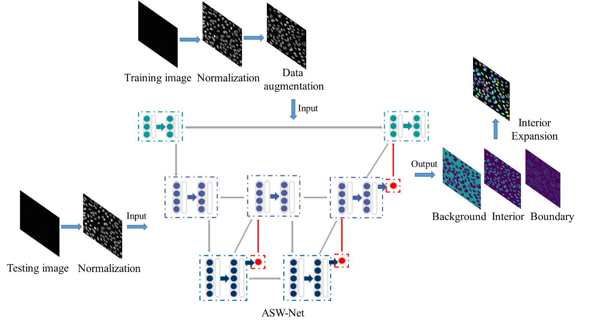

# ASWNet
ASW-Net: A Deep Learning-based Tool for Cell Nuclei Segmentation of Fluorescence Microscopy

## Overview
ASW-Net is a deep learning-based tool for cell nucleus segmentation of fluorescence microscopy. As a simplified W-net, ASW-Net has the potential to extract more features from raw images compared with U-net, and it is lighter than W-net at the same time. The attention mechanism also endows the model with better learning ability and interpretability.
<p align="center"></p>
The detailed structure of ASW-Net is shown as below:
<p align="center"></p>

## Quick Start

### Requirements
- Python 3.6+
- Keras == 2.2.4, Tensoflow == 1.14.0

### Download SWNet
```shell
git clone https://github.com/Liuzhe30/ASW-Net
```

## Progress
- [x] README for running ASW-Net.

## Citation
Please cite the following paper for using this code: 
```
Pan, W.; Liu, Z.; Song, W.; Zhen, X.; Yuan, K.; Xu, F.; Lin, G.N. An Integrative Segmentation Framework for Cell Nucleus of Fluorescence Microscopy. Genes 2022, 13, 431. https://doi.org/10.3390/genes13030431
```